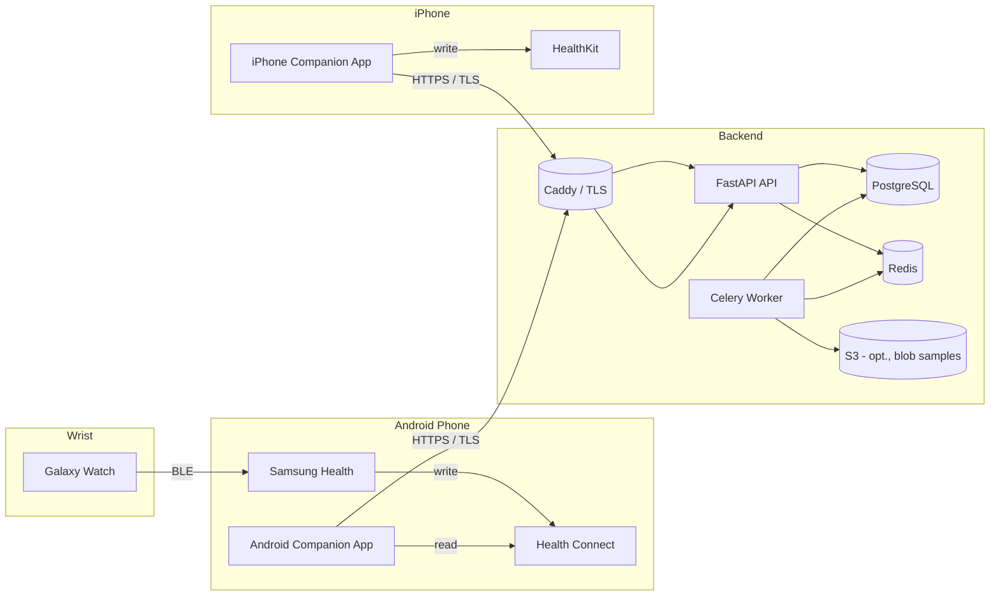
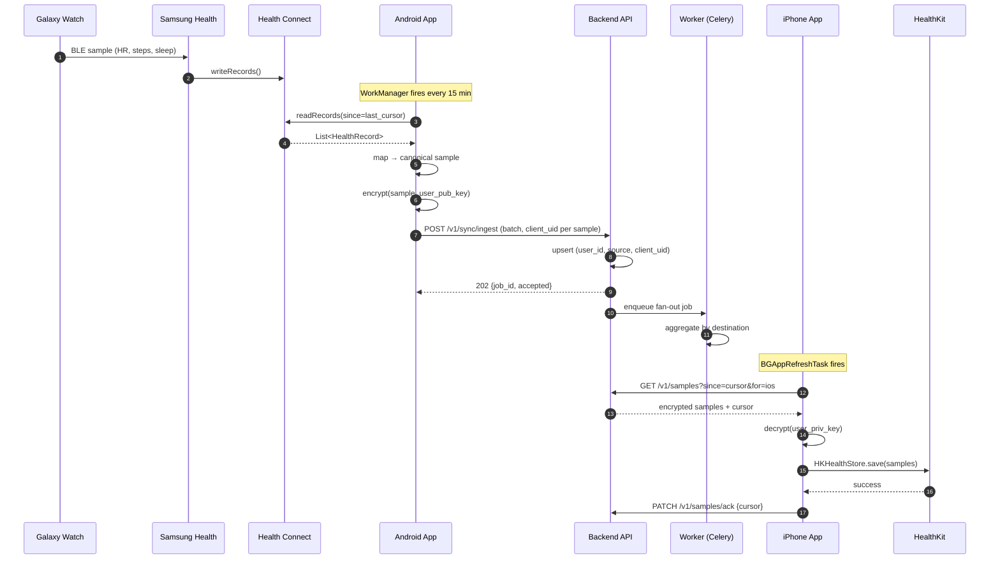
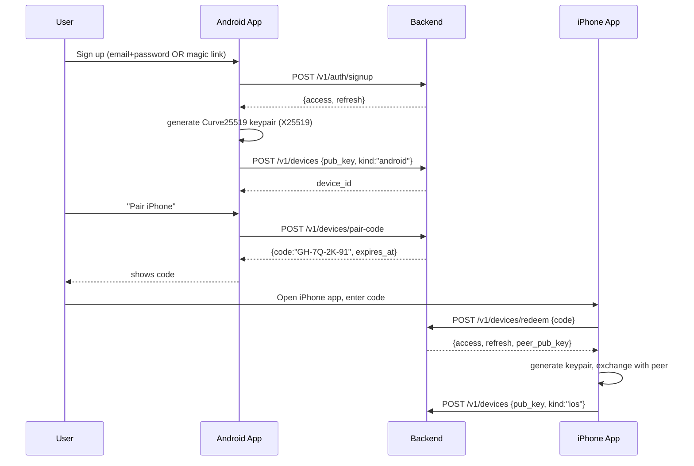

# Section 2 — Architecture

## 2.1 High-level



## 2.2 Sequence: end-to-end sync



## 2.3 Sequence: device pairing



## 2.4 Data flow contract

Canonical sample schema (lingua franca between Android and iOS):

```json
{
  "client_uid": "01HV2P7K6E5R3Q8M2J9XYZ0001",   // UUIDv7 from Android
  "source": "samsung-health",
  "type": "heart_rate",
  "unit": "bpm",
  "value": 72.0,
  "started_at": "2026-06-18T14:30:00Z",
  "ended_at":   "2026-06-18T14:30:01Z",
  "device": { "manufacturer": "Samsung", "model": "Galaxy Watch7" },
  "metadata": { "samsung_uid": "...", "confidence": 0.99 }
}
```

Encryption envelope (when E2E mode on):

```json
{
  "client_uid": "01HV2P7K6E5R3Q8M2J9XYZ0001",
  "type": "heart_rate",
  "started_at": "2026-06-18T14:30:00Z",
  "ended_at":   "2026-06-18T14:30:01Z",
  "nonce_b64": "...",
  "ciphertext_b64": "..."
}
```

Server sees only the outer envelope. Type and timestamps are intentionally plaintext so the server can dedupe and index without decryption.

## 2.5 Component responsibilities

| Component | Owns | Does NOT own |
|---|---|---|
| Android app | Health Connect reads, mapping, encryption, upload, retry queue | Display analytics, push notifications to iPhone |
| iPhone app | Download, decryption, HealthKit writes, dedupe vs HealthKit anchor | Reading Health Connect |
| Backend API | Auth, device registry, sample storage, fan-out, audit log | Decryption, HealthKit write |
| Worker | Aggregation, retention enforcement, webhook delivery | User-facing request handling |
| Postgres | Source of truth for everything except blob bodies | Sample blobs (over 1KB → S3) |
| Redis | Job queue, rate-limit counters, ephemeral sync cursors | Persistent data |
