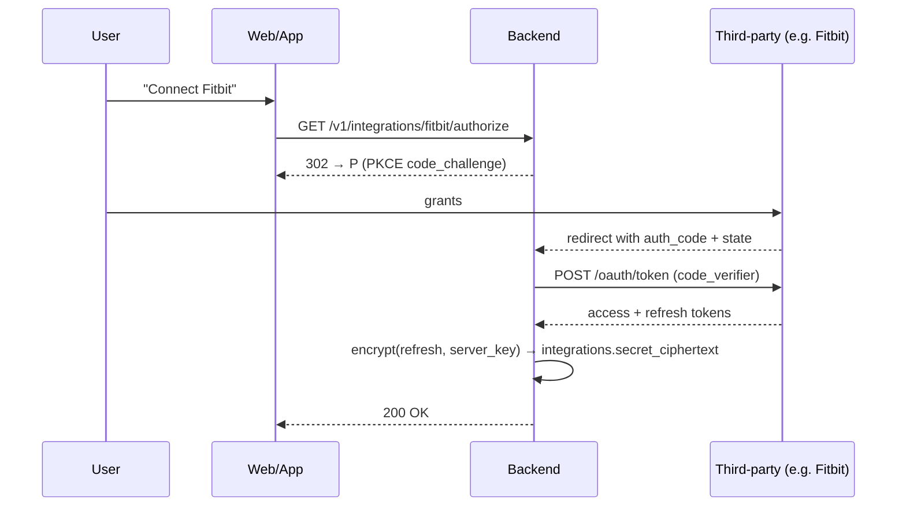

# Section 16 — Security

## Threat model (STRIDE on the sync flow)

| Asset | Threat | Mitigation |
|---|---|---|
| Health samples in transit (Android → API) | Spoofing (rogue server), Tampering, Information disclosure | TLS 1.3 + Caddy auto-TLS in dev, ACM in prod. JWT bearer with 15-min TTL. |
| Health samples at rest in Postgres | Information disclosure (operator, leaked backup) | E2E mode encrypts sample bodies on the originating device (X25519 sealed boxes); server stores ciphertext + opaque dedupe metadata. Postgres at-rest encryption via RDS KMS. |
| User passwords | Brute force, credential stuffing | argon2id (3 iters, 64 MiB, parallelism 4). 12-char minimum. 10/min login rate limit per IP, exponential lockout after 10 failures. |
| Refresh tokens | Theft, replay | HMAC-SHA256 fingerprint stored, not plaintext. Single-use rotation on `/v1/auth/refresh` (old token revoked). Bind to device_id. |
| Pair codes | Brute force enumeration | 30^6 keyspace (~7×10^8), TTL 5 min, 5-attempt lockout, HMAC-SHA256 stored. |
| API keys (future) | Theft | `ghb_pat_…` prefix, HMAC at rest, scoped, last-used tracking, dashboard revocation. |
| Plaintext leak via logs | Operator / observability mistake | Structured logger forbids `sample.value` / `sample.payload` fields; CI grep job blocks `logger.*sample`. |
| Mobile device theft | Unauthorized sync | Local data in iOS Keychain (`AfterFirstUnlockThisDeviceOnly`). Android uses encrypted DataStore. Device pair revocable from any other device on the account. |
| Replay of ingest batch | Duplicate writes | Idempotent on `(user_id, source, client_uid)` unique constraint. Re-POSTing the same batch returns the same accepted/duplicate counts. |
| Supply chain | Malicious dependency / image | Dependabot weekly + Trivy + pip-audit + cosign-signed images. SBOM published with every release. |

## Encryption strategy

### Per-user E2E keys (cloud, optional for self-host)

```
on first launch (Android):
  sk_a, pk_a = X25519.keygen()
  store sk_a in Android Keystore
  POST /v1/users/me/keys { pk_a }

on iPhone pairing:
  sk_i, pk_i = X25519.keygen()
  store sk_i in iOS Keychain
  POST /v1/devices { pub_key: pk_i }
  GET  /v1/users/me/keys → { pk_a }

upload (Android):
  for each sample:
    nonce = random(24)
    ct = SealedBox(pk_i).encrypt(json(sample), nonce)
    POST envelope { client_uid, type, started_at, ended_at, nonce, ct }

download (iPhone):
  for each envelope:
    plaintext = SealedBox(sk_i).decrypt(ct, nonce)
    HKHealthStore.save(plaintext)
```

Server never sees plaintext. Type + timestamps stay outside the envelope so we can dedupe + page.

### Server-managed secrets

Integration tokens (OAuth refresh tokens, webhook secrets) are encrypted with `XChaCha20-Poly1305` using `ENCRYPTION_KEY` (32 bytes). Key rotation: new `ENCRYPTION_KEY_NEXT` env, dual-decrypt window, background re-encryption job.

## Secret management

| Env | Mechanism |
|---|---|
| Local dev | `.env` file, gitignored |
| Compose / Docker | `.env` next to compose file, `chmod 600`, `secret` blocks for K8s deployment |
| Kubernetes | External Secrets Operator → SealedSecrets → cloud KMS |
| AWS | Secrets Manager + KMS (Terraform provisions both) |

## OAuth2 flow (for future third-party integrations)



## Rate limiting

`slowapi` Redis-backed. Defaults:

| Surface | Limit |
|---|---|
| Anonymous signup | 5/min per IP |
| Anonymous login | 10/min per IP |
| `/v1/sync/ingest` | 120/min per user (covers a busy Galaxy Watch comfortably) |
| Refresh | 60/min per token |
| Pair-code redeem | 10/min per IP, 5 attempts per code |

429 responses include `Retry-After`.
